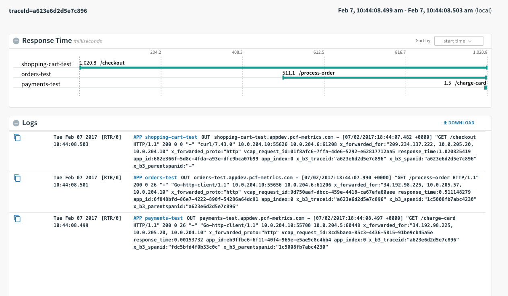

[](https://travis-ci.org/pivotal-cf/pcf-metrics-trace-example-golang)

# PCF Metrics Go Tracer Example

This is a Go repository with three apps: shopping-cart, orders, and payments.
These apps use custom middleware that carries `X-B3-TraceId` and `X-B3-SpanId` headers that the CF router injects to trace the calls between them. The traces can then be viewed in PCF-Metrics.

## Creating your own tracer apps

To add tracing the following is necessary:

- Every subsequent request should have `X-B3-TraceId` and `X-B3-SpanId` headers with the values from the current request headers (see `/middlewares/proxy_middleware`)

## Using the example apps

### DEPLOY
To use the script, you must login as a user that has the ability to assign space permissions and make spaces.
It will create a given shopping-cart, orders, and payments app that can be used to preview an example trace.

To deploy, use the script `./scripts/deploy.sh`.
Set the `SUFFIX` ENV var to a unique identifier for your tracer applications.

#### For example
```
cf login
SUFFIX=test ./scripts/deploy.sh
```

### CURL APPS
Curl the `/checkout` endpoint for the given shopping cart app.

#### For example
```
curl shopping-cart-test.cfapps.io/checkout
```

### Viewing in PCF-Metrics

To view the trace in PCF-Metrics, go to the shopping-cart app in PCF-Metrics.
Find the log corresponding to the /checkout endpoint and click the 'View in Trace Explorer' icon.

#### For example
